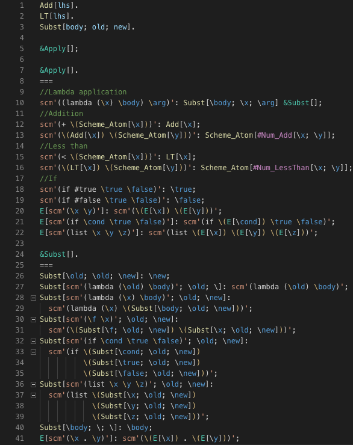

# treescript-vscode

Adds support for the [TreeScript](https://github.com/Jakobeha/treescript#readme) language. Syntax highlighting and (coming soon) a language client for building and running TreeScript

## Features

Currently only supports syntax highlighting. In the future will support more, such as highlighting error messages and refactors.

## Requirements

No requirements for the syntax highlighting. See [TreeScript's homepage](https://github.com/Jakobeha/treescript#readme) for how to install the TreeScript compiler / interpreter.

## Extension Settings

None yet, the current settings don't actually do anything.

## Known Issues

Syntax highlighting for certain languages not supported, syntax highlighting after a code splice not supported, JavaScript syntax highlighting messes up some of the splices.

## Release Notes

### 0.1.0

Initial release
